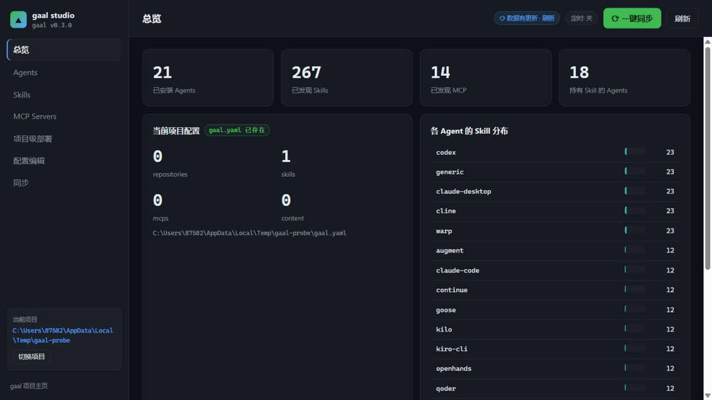
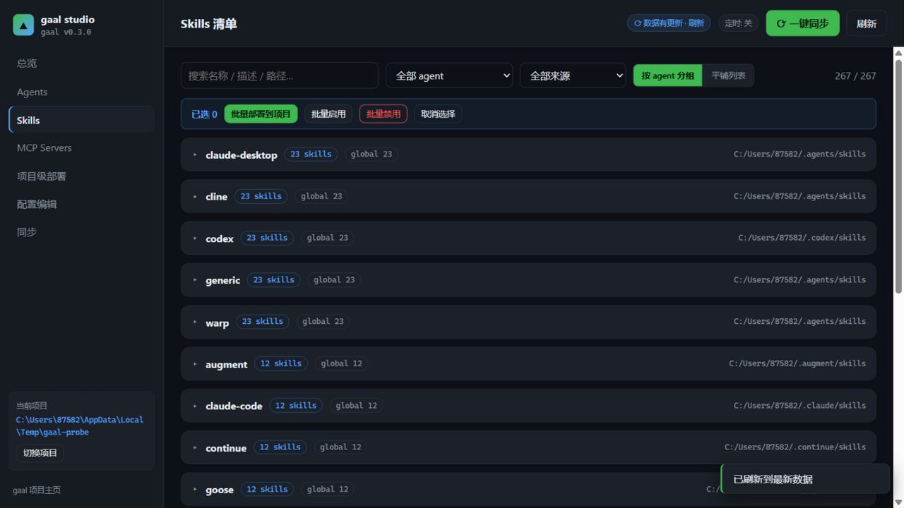
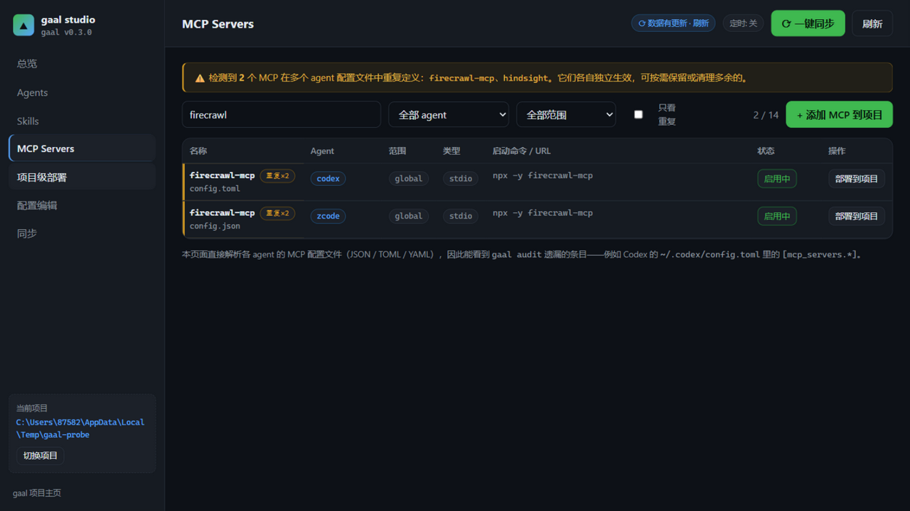
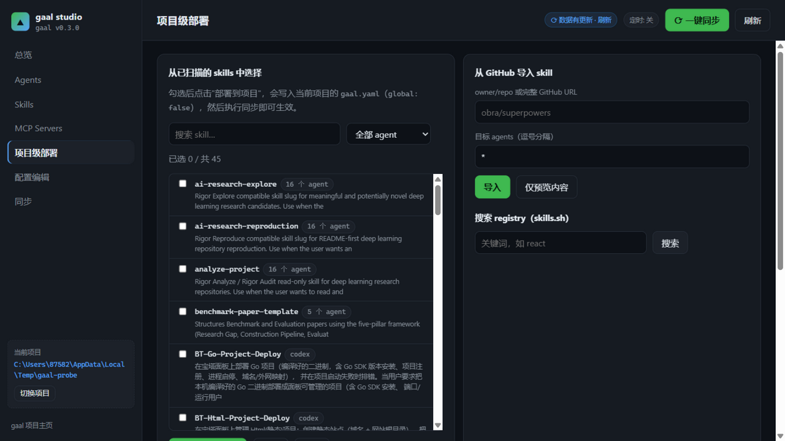

# skills_mcp

[gaal](https://github.com/getgaal/gaal) 生态工具的工作区。目前包含：

| 目录 | 说明 |
|---|---|
| [gaal-studio/](gaal-studio/) | gaal 的本地可视化管理面板：在一个界面里查看和管理所有 AI 编程 agent 的 skills 与 MCP 配置 |

## gaal-studio 快览

- **零框架**：Node.js ≥ 18 原生 HTTP 服务 + 原生 JS 前端，运行时依赖仅 2 个
- **全 agent 覆盖**：解析 gaal 注册的 agent，并补充 zcode / qoder；直接读取各 agent 的 JSON / TOML / YAML MCP 配置
- **安全的写入**：所有配置修改原子落盘（临时文件 + rename），尽量保留手写的 YAML 注释；部署/移除前提供 `gaal.yaml` 行级 diff 预览
- **可逆操作**：skills / MCP 的启用与禁用均可从备份恢复
- **同步**：手动、SSE 实时输出、定时三种方式，服务端互斥防止并发跑多个 `gaal sync`

```bat
cd gaal-studio
start.bat        :: 启动并自动打开浏览器（或 npm start，默认 http://127.0.0.1:7788）
```

## 截图

**总览** — 资源统计与各 agent 的 skill 分布



**Skills 清单** — 搜索过滤、批量部署/启用/禁用



**MCP Servers** — 跨 agent 的 MCP 配置解析、重复定义检测



**项目级部署** — 本机 skill 按名称去重浏览（悬停查看装了哪些 agent）、按 agent 筛选、当前项目内资源一键写入声明



功能详情、环境变量、安全模型与开发说明见 [gaal-studio/README.md](gaal-studio/README.md)。

## 开发

```bash
cd gaal-studio
npm run check    # 全部 JS 文件语法检查 + 测试套件
```

## License

[MIT](gaal-studio/LICENSE)
